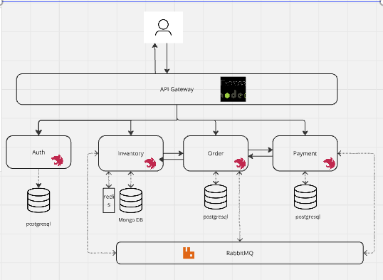

# Order Management System (OMS) - Microservices Architecture

## Index
- [Architecture Diagram](#architecture)
- [How to Run the Application](#setup-instructions)
- [Swagger Documentation](#6-access-swagger-documentation)
- [Default Credentials](#default-credentials)

## Project Overview
The **Order Management System (OMS)** is a microservices-based architecture that simulates a real-world e-commerce system. It provides functionalities for managing orders, inventory, and payments, while supporting synchronous and asynchronous communications.

## Key Features
- **Order Service**: Handles customer orders.
- **Inventory Service**: Manages product stock levels.
- **Payment Service**: Processes and tracks payments.
- **API Gateway**: Centralized routing and security.
- **Message Queue (RabbitMQ)**: Enables asynchronous event-driven communication.

## Architecture


### Services
1. **Auth Service**: Handles user authentication.
2. **Order Service**: Manages order placement and retrieval.
3. **Inventory Service**: Tracks stock levels and updates after orders.
4. **Payment Service**: Processes payments and retrieves payment status.
5. **API Gateway**: Routes requests and ensures security.
6. **RabbitMQ**: Facilitates asynchronous communication.

## Directory Structure
```
oms-micro-service
├── auth-app
├── docker-compose.yml
├── inventory-app
├── oms-api-gateway
├── order-app
└── payment-app
```
### Individual Service Structures
- Each service contains its own `Dockerfile`, `README.md`, `src` directory, and configuration files.

## Prerequisites
- Docker and Docker Compose
- Node.js (for local development)
- PostgreSQL and MongoDB clients (optional for database inspection)

## Setup Instructions

### 1. Clone the Repository
```bash
git clone https://github.com/your-repo/oms-microservice.git
cd oms-microservice
```

### 2. Set Up Environment Files
- Copy the `.env.example` file to `.env` for the root directory:
  ```bash
  cp .env.example .env
  ```
- Navigate into each service directory (`auth-app`, `order-app`, `inventory-app`, `payment-app`, `oms-api-gateway`) and copy their respective `.env.example` files to `.env`:
  ```bash
  cp auth-app/.env.example auth-app/.env
  cp order-app/.env.example order-app/.env
  cp inventory-app/.env.example inventory-app/.env
  cp payment-app/.env.example payment-app/.env
  cp oms-api-gateway/.env.example oms-api-gateway/.env
  ```

### 3. Install Docker
- Ensure Docker and Docker Compose are installed on your system:
  - [Download Docker](https://www.docker.com/products/docker-desktop)

### 4. Build and Run the Services
- From the root directory, build and start all services using Docker Compose:
  ```bash
  docker-compose up --build
  ```

### 5. Access the Application
- **API Gateway**: Open your browser or API client and go to:
  ```
  http://localhost:3000
  ```
- **RabbitMQ Management Console**:
  ```
  http://localhost:15672
  ```
  - Default credentials: `guest` / `guest`

### 6. Access Swagger Documentation
Each service exposes its Swagger API documentation at the following URLs:

- **Auth Service**: `http://localhost:3004/api-docs`
- **Order Service**: `http://localhost:3002/api-docs`
- **Inventory Service**: `http://localhost:3001/api-docs`
- **Payment Service**: `http://localhost:3003/api-docs`

- **Default Credentials**:
  - Username: `admin`
  - Password: `password`

Swagger provides detailed documentation of each service's endpoints.

### 7. Verify Service Logs
- Check if all services are running properly:
  ```bash
  docker ps
  ```

### 8. Stop Services
- To stop and clean up resources:
  ```bash
  docker-compose down
  ```

## Default Credentials
Below are the default credentials used for the services:

### RabbitMQ
- **Management Console**:
  - URL: `http://localhost:15672`
  - Username: `oms_guest`
  - Password: `oms_guest`

### PostgreSQL (For Auth, Order, Payment Services)
- **Default Credentials**:
  - Username: `oms_user`
  - Password: `example`
  - Database: `oms_db`

### MongoDB (For Inventory Service)
- **Default Credentials**:
  - Username: `root`
  - Password: `example`

Ensure these are properly configured in your `.env` files for each service.

## Services

### Auth Service
- **Endpoints**:
  - `POST /auth/register`: Register a user.
  - `POST /auth/login`: Authenticate a user.

### Order Service
- **Endpoints**:
  - `POST /orders`: Place a new order.
  - `GET /orders/{id}`: Retrieve an order by ID.
  - `GET /orders`: Retrieve all orders.

### Inventory Service
- **Endpoints**:
  - `GET /inventory/{product_id}`: Get product stock.
  - `PUT /inventory/{product_id}`: Update stock after an order.
  - `POST /inventory`: Add new products.

### Payment Service
- **Endpoints**:
  - `POST /payments`: Process payments.
  - `GET /payments/{id}`: Retrieve payment status.

## Message Queue
RabbitMQ facilitates asynchronous communication between services, ensuring the following:
- **PaymentConfirmed Event**: Finalizes orders status as completed and deducts stock upon payment confirmation.

## Database Schema

### Order Service
| Field        | Type    | Description         |
|--------------|---------|---------------------|
| id           | UUID    | Primary key         |
| customer_id  | UUID    | ID of the customer  |
| total_amount | Decimal | Total order amount  |
| status       | String  | Order status        |

### Inventory Service
| Field   | Type    | Description       |
|---------|---------|-------------------|
| id      | UUID    | Primary key       |
| name    | String  | Product name      |
| category| String  | Product category  |
| price   | Decimal | Product price     |
| stock   | Integer | Available stock   |

### Payment Service
| Field   | Type    | Description       |
|---------|---------|-------------------|
| id      | UUID    | Primary key       |
| order_id| UUID    | Associated order  |
| status  | String  | Payment status    |
| amount  | Decimal | Payment amount    |

[//]: # (## Scaling and Deployment)

[//]: # (- **Docker**: Containerized all services.)

[//]: # (- **Kubernetes**: Ready for orchestration.)

[//]: # (- **Distributed Tracing**: Integrated Jaeger for monitoring.)

[//]: # (- **Resilience**: Circuit breakers using Hystrix/Resilience4j.)

[//]: # ()
[//]: # (## Testing)

[//]: # (- Write end-to-end tests using Postman or Cypress.)

[//]: # (- Run tests with the following command:)

[//]: # (  ```bash)

[//]: # (  npm run test)

[//]: # (  ```)

## Future Enhancements
- Add a frontend using React or Angular.
- Integrate ELK Stack for centralized logging.
